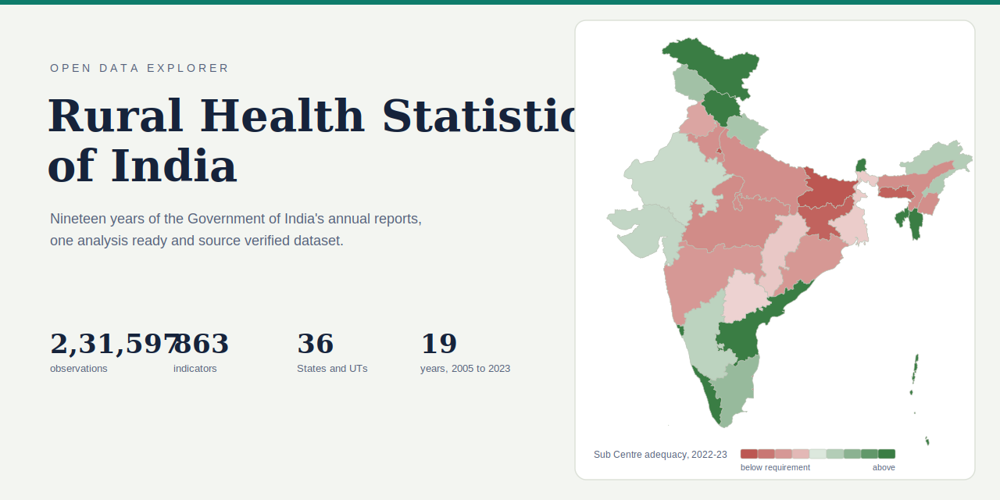

# Rural Health Statistics of India: Data Explorer

An interactive explorer built on an analysis-ready dataset compiled from the
Government of India's Rural Health Statistics annual reports, 2005 to 2022-23.

**Live site:** enable GitHub Pages on this repository (Settings, Pages, deploy
from branch, `main` and `/root`) and the dashboard is served at
https://suraj-bhor.github.io/rhs-india/.

## About the dataset

- 2,31,597 observations: one row per Year, State, Indicator and Value.
- 863 indicators across 12 domains, harmonised from 1,010 raw column names
  across the two reporting eras (2005-18 and 2019-23).
- All 36 States and Union Territories, with boundary changes tracked
  explicitly (Telangana 2014, J&K and Ladakh 2019-20, the DNH and
  Daman & Diu merger 2020).
- Special values preserved as reported: `*` and `**` mark surpluses,
  `NA` not available, `N App` not applicable. Never coerced to zero.
- Verified with 1,300+ automated checks, including value by value comparison
  against the printed source tables.

## Data availability

The dataset is currently shared on request while it is being prepared for
formal release. Write to the maintainer with a line on your intended use and
the files will be sent to you: the long format table, the indicator
dictionary, per year tables for 2005 to 2023, and twelve thematic tables in
CSV and XLSX.

This is an independent research compilation, not an official publication of
the Ministry of Health & Family Welfare. For policy citation, cross-check
figures against the original report of the relevant year.
