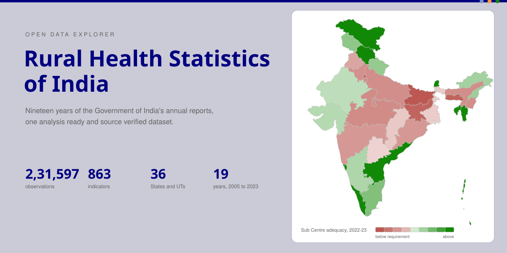

<p align="center"></p>

# Rural Health Statistics of India: Data Explorer

[](https://doi.org/10.5281/zenodo.21966746)
[](https://creativecommons.org/licenses/by-nc-nd/4.0/)

An interactive explorer built on an analysis-ready dataset compiled from the
Government of India's Rural Health Statistics annual reports, 2005 to 2022-23.

**Live site:** enable GitHub Pages on this repository (Settings, Pages, deploy
from branch, `main` and `/root`) and the dashboard is served at
https://suraj-bhor.github.io/rhs-india/

## About the dataset

- 2,31,597 observations: one row per Year, State, Indicator and Value.
- 863 indicators across 12 domains, harmonised from 1,010 raw column names
  across the two reporting eras (2005-18 and 2019-23).
- All 36 States and Union Territories, with boundary changes tracked
  explicitly (Telangana 2014, J&K and Ladakh 2019-20, the DNH and
  Daman & Diu merger 2020).
- Special values preserved as reported: `*` and `**` mark surpluses,
  `NA` not available, `N App` not applicable. Never coerced to zero.
- Verified with 1,300+ automated checks, including value by value comparison
  against the printed source tables.

## Integrity

Each release is distributed as a single archive with a `CHECKSUMS.txt` manifest
(SHA-256 per file), so recipients can verify integrity. The v1.0 distribution
archive `RHS_dataset_v1.0.zip` has SHA-256:

```
2d8350f253e1eb747980d7ed4a9aa37a5111af0d879b88f6fd225b9381c91fda
```

## Data availability

The dataset is currently shared on request while it is being prepared for
formal release. Write to the maintainer with a line on your intended use and
the files will be sent to you: the long format table, the indicator
dictionary, per year tables for 2005 to 2023, and twelve thematic tables in
CSV and XLSX.

Full documentation — indicator naming, special-value semantics, the two
reporting eras, boundary changes, verification, changelog and known
limitations — is in [`CODEBOOK.md`](CODEBOOK.md).

## License

The compiled dataset, documentation and Data Explorer are licensed
[**CC BY-NC-ND 4.0**](https://creativecommons.org/licenses/by-nc-nd/4.0/)
(Attribution — NonCommercial — NoDerivatives). See [`LICENSE`](LICENSE). The underlying facility
and workforce figures are Government of India material (MoHFW, Rural Health
Statistics reports); this project claims no rights over them.

## How to cite

Plain text:

```
Bhor, S., & Zadey, S. (2026). Rural Health Statistics of India — harmonised dataset, 2005–2023 (Version 1.0) [Data set]. Zenodo. https://doi.org/10.5281/zenodo.21966746
```

BibTeX:

```bibtex
@dataset{bhor_zadey_2026_rhs,
  author    = {Bhor, Suraj and Zadey, Siddhesh},
  title     = {{Rural Health Statistics of India --- harmonised dataset, 2005--2023}},
  year      = {2026},
  version   = {1.0},
  publisher = {Zenodo},
  doi       = {10.5281/zenodo.21966746},
  url       = {https://doi.org/10.5281/zenodo.21966746}
}
```

## Acknowledgements

We thank Yash Jawale for valuable feedback on the release of the dashboard.

This is an independent research compilation, not an official publication of
the Ministry of Health & Family Welfare. For policy citation, cross-check
figures against the original report of the relevant year.
